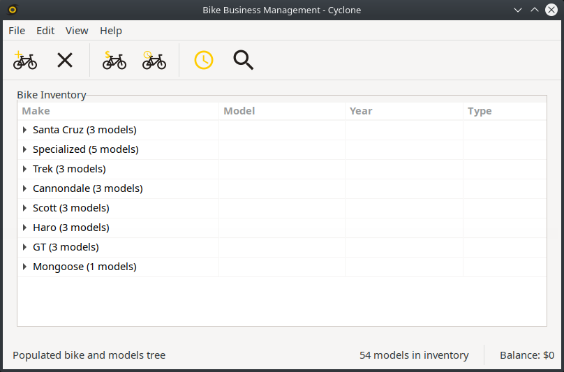
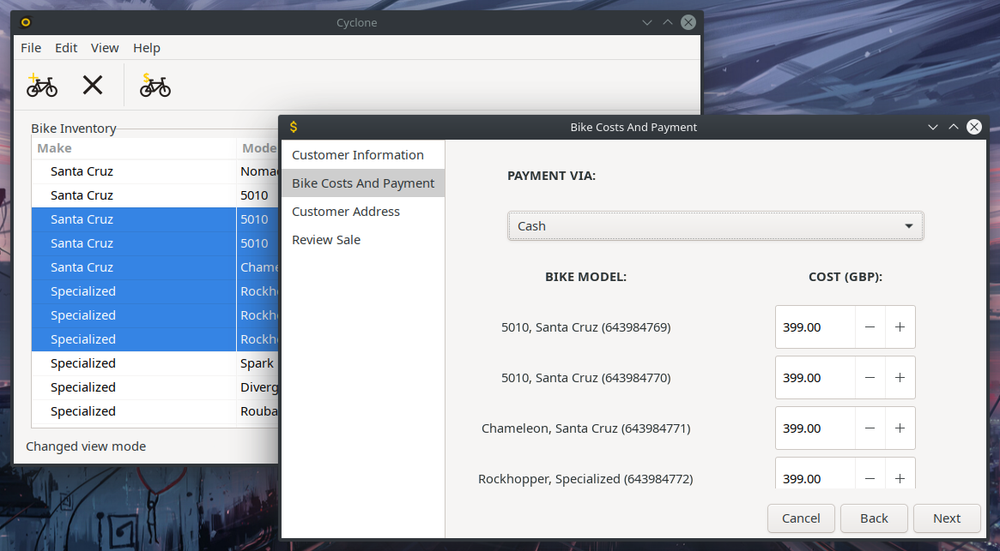
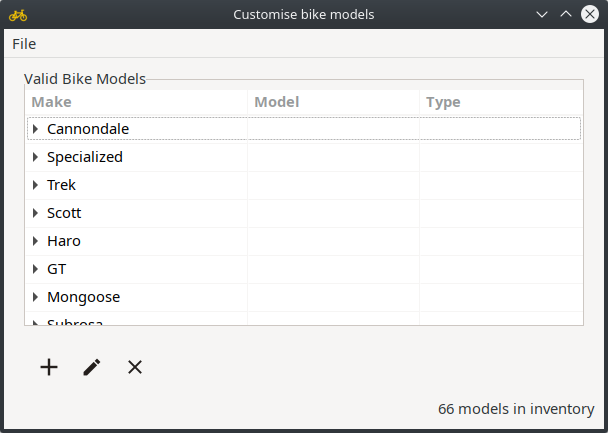

# Cyclone
#### Bike business management utility  

#### Features  
* Add and purchase bikes
* Remove bikes
* Sell bikes, record client information and address
* Keep track of your monetary balance
* Program data is saved between uses
* Keep a specific list of valid bike models and edit it
* Switch between a grouped view and expanded one

Application still on development. Currently not working on Windows or Mac OS. Requires gtk-sharp-3.
